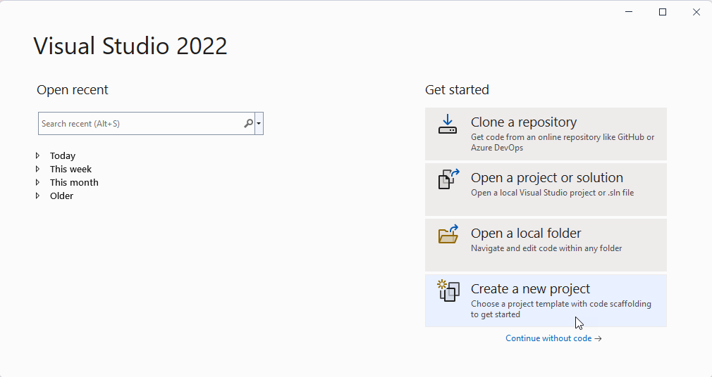
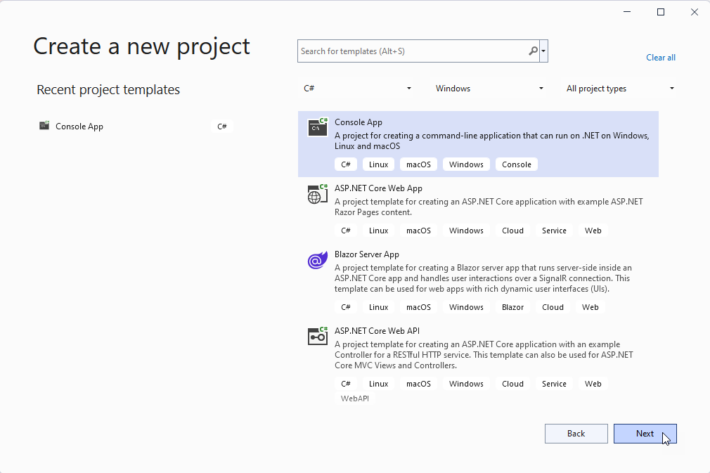
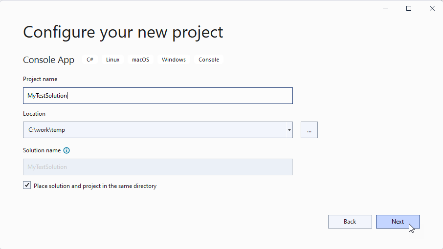
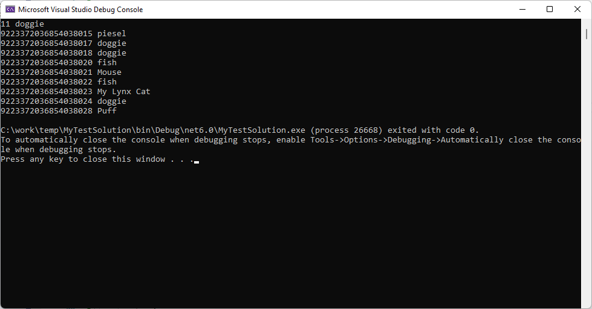

## Intro

The PetStore is the largest artificial marketplace in the world where you can sell and buy artificial animals. The PetStore marketplace provides an API that you can use to integrate PetStore to your application, for example, your warehouse management software. With such integration you can to synchronize your warehouse items with the PetStore items: your warehouse software will reflect all the changes made within the PetStore, and vice versa.


## Work with pets in the store

The PetStore API is available at https://petstore.swagger.io/v2/.

This section explains how to:

- add a pet to the store
- delete a pet from the store
- get a pets from the store

### Add a pet to the store

To add a new pet to the store, use the POST method against the `/pet` endpoint. For example:

```console
curl -X 'POST' \
  'https://petstore.swagger.io/v2/pet' \
  -H 'accept: application/json' \
  -H 'Content-Type: application/json' \
  -d '{
  "id": 0,
  "category": {
    "id": 0,
    "name": "string"
  },
  "name": "My Lynx Cat",
  "photoUrls": [
    "string"
  ],
  "tags": [
    {
      "id": 0,
      "name": "string"
    }
  ],
  "status": "available"
}'
```

When executed, this command adds a new cat with the "My Lynx Cat" name. In the response, the server sends a JSON object that represents a newly added pet:

```json
{
  "id": 9223372036854039000,
  "category": {
    "id": 0,
    "name": "string"
  },
  "name": "My Lynx Cat",
  "photoUrls": [
    "string"
  ],
  "tags": [
    {
      "id": 0,
      "name": "string"
    }
  ],
  "status": "available"
}
```

### Remove a pet from the store

To remove a pet from the store use the DELETE method against the `/pet/{petId}` endpoint, where `{petId}` is a required pet's id property value. 

The command below requests a server to remove a pet whose id is '12345':

```console
curl -X 'DELETE' \
  'https://petstore.swagger.io/v2/pet/12345' \
  -H 'accept: application/json'
```

### Get a pet from the store

To obtain a pet from the store, use the GET method against the `/pet/{petId}` endpoint, where `{petId}` is a required pet's id property value. 

The command below requests a server to get a pet whose id is '12345':

```console
curl -X 'GET' \
  'https://petstore.swagger.io/v2/pet/12345' \
  -H 'accept: application/json'
```

In the response, the server sends a JSON object that represents a requested pet:

```json
{
  "id": 12345,
  "category": {
    "id": 1,
    "name": "Peacock"
  },
  "name": "lion",
  "photoUrls": [
    "no Photo"
  ],
  "tags": [
    {
      "id": 1,
      "name": "Horse"
    }
  ],
  "status": "available"
}
```

## Example

This example demonstrates how to load ten available animals (their status is 'available') and display them on screen.

### Requirements

- Microsoft Visual Studio 2022 with the .NET desktop development workload

### Steps to reproduce

1. Run Microsoft Visual Studio 2022. 
2. Select "Create a new project".
    
    
3. In a project template list, select "Console App" and click Next.
    
4. Specify the project name and its location and click Next.
    
5. Select the **.NET 6.0 (Long-term support)** framework and click Create.
6. Visual Studio creates a new project for you and opens a *Program.cs* file. Replace the file content with the following code:

    ```cs
    using System.Net.Http.Json;
    using System.Text.Json;

    namespace MyTestSolution {
        internal class Program {
            static void Main() {
                HttpClient httpClient = new() {
                    BaseAddress = new Uri("https://petstore.swagger.io/v2/")
                };

                var response = httpClient.GetFromJsonAsync<object>($"pet/findByStatus?status=available");
                if (response.Result == null) {
                    Console.WriteLine("Could not load pets");
                    return;
                }

                // Parse the result from response.
                var jsonElement = (JsonElement)response.Result;

                // Take 10 items, as we have no need to load all the pets.
                var jsonElementArray = jsonElement.EnumerateArray().Take(10).ToArray();

                foreach (var item in jsonElementArray) {
                    // Sometimes, the requested pets may have no name or id specified.
                    // To ensure they are specified, use the TryGetProperty method. 
                    item.TryGetProperty("id", out JsonElement id);
                    item.TryGetProperty("name", out JsonElement name);

                    Console.WriteLine("{0} {1}", id.ToString(), name.ToString());

                }
            }
        }
    }
    ```
7. Press F5 to compile the project and run it in debug mode.

    
